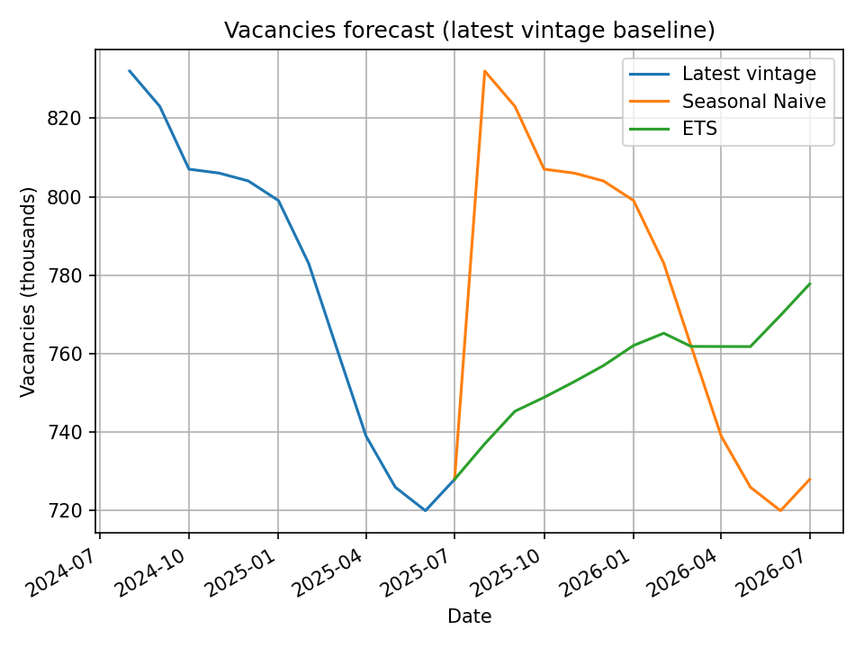

# Bank of England – MPT – Data Scientist Take‑Home (Vacancy AP2Y)

This repository implements an end‑to‑end, **reproducible** mini‑project for the ONS vacancy series (AP2Y), focusing on:
- **Automated ingestion** of CSV vintages from ONS “previous versions”
- **Vintage‑aware structuring** of monthly observations
- **Revision visualisation**
- **Simple forecasting baselines**
- **Best practices** (tests, lint, CI, Make targets)

> **Target series:** https://www.ons.gov.uk/employmentandlabourmarket/peopleinwork/employmentandemployeetypes/timeseries/ap2y/lms/previous

---

## Quickstart (3–5 minutes)

```bash
# 0) Create and activate a fresh venv (recommended)
python -m venv .venv
source .venv/bin/activate  # (Windows cmd.exe: .venv\Scripts\activate.bat)

# 1) Install dependencies
pip install -U pip
pip install -r requirements.txt

# 2) (Optional) Install dev tooling
pip install -r requirements-dev.txt
pre-commit install

# 3) End-to-end run
make all
# or stepwise:
make download     # scrape & download >=20 CSV vintages
make build        # parse/clean -> long-format dataset
make viz          # revision path plot into reports/figures
make forecast     # seasonal naive + ETS (plot + CSV outputs)
```

Outputs:
- Processed data: `data/processed/vacancies_long.csv`
- Revisioon plot: `reports/figures/revision_path_YYYY-MM.png`
- Forecast plot: `reports/figures/forecast_latest.png`

---

## Project structure

```
boe-mpt-vacancies/
├─ src/boe_vac/
│  ├─ ingest.py        # HTML scrape, download CSVs, manifest
│  ├─ parse.py         # Parse ONS CSVs: metadata (incl. vintage) + data table
│  ├─ transform.py     # Monthly filter, long-format, typing
│  ├─ viz.py           # Revision path plot
│  └─ forecast.py      # Baseline (seasonal naive + ETS)
├─ data/
│  ├─ raw/             # downloaded CSVs (cached)
│  └─ processed/       # long-format outputs
├─ reports/figures/    # PNG charts
├─ tests/              # unit tests (no network)
├─ Makefile            # make setup/download/build/viz/forecast/all
├─ requirements.txt    # runtime deps
├─ requirements-dev.txt# dev/test/format deps
├─ pyproject.toml      # ruff/black cfg + project meta
├─ pytest.ini          # test paths
├─ .pre-commit-config.yaml
└─ .github/workflows/ci.yml
```

---

## Design choices (high‑level)

- **Vintage = CSV header `Release date`** (parsed from each file’s metadata). When absent, log a warning.
- **Monthly only**: `Period` is parsed with robust regex for `YYYY MON` formats. Quarterly/Yearly rows are dropped.
- **Schema (long)**:
  - `vintage_date` (YYYY‑MM‑DD), `observation_month` (YYYY‑MM‑01), `value` (int)
  - extra: `series_id`, `dataset_id`, `pre_unit`, `unit`
- **Reproducibility**: zero hard‑coded absolute paths; `Makefile` targets; deterministic outputs; tests use **mock HTML & CSV** (no network needed).
- **Forecast mindset**: For brevity, the default run fits a simple baseline on the latest vintage.

---

## Commands

- `python -m src.boe_vac.ingest --num-files 20`
  Scrape previous page, collect CSV links, download into `data/raw/` and write a manifest.

- `python -m src.boe_vac.transform`
  Parse raw CSVs → extract metadata (incl. `vintage_date`) and monthly data → write `data/processed/vacancies_long.csv`.

- `python -m src.boe_vac.viz --month 2024-01`
  Plot revision path for the given observation month.

- `python -m src.boe_vac.forecast --horizon 12`
  Fit Seasonal Naive + ETS on the latest vintage series, save forecast figure & CSV.

---

## Patterns & Revisions Over Time

Below is an example revision path focusing on **January 2024**.
*(Regenerate by running: `python -m src.boe_vac.viz --month 2024-01`)*


**Observation**
UK vacancy statistics are generally published each month between the **10th and the 20th**. At each release, the observation for **T‑2** (two months prior) is newly published and earlier observations are **revised**.

For example, the vacancy estimate for **January 2024** was first published on **12 March 2024** at **908** *(thousands)*. Over the next **three releases** it was revised up to **916** by **11 June 2024**. That value then held for a while, before being revised down more substantially on **20 March 2025** and **15 April 2025**, leaving the latest value at **904** — **lower than the initial estimate**.

---

## Forecast Output
Below is the baseline forecast generated from the **latest vintage** series.
This figure includes the recent history and the forecast paths for the **requested horizon** (default: 12 months).
*(Regenerate by running: `python -m boe_vac.forecast --horizon 12`)*



---

## Forecasting Performance Evaluation

**Goal.** Evaluate forecast accuracy in a way that mirrors production reality **and** accounts for data revisions across vintages.

### 1) Rolling Forecast Origin (Time‑Series CV)
- Use a **rolling (or expanding) window** with multiple forecast origins.
- For each origin **V** (a specific *vintage date*), train only on data **available as of V** (no look‑ahead), then produce h‑step‑ahead forecasts for h ∈ {1, 2, ..., 12}.
- Aggregate errors across many origins to get robust, horizon‑specific results.

### 2) Vintage‑Aware “Truths”
Evaluate forecasts against two complementary definitions of ground truth:
- **Real‑time (as first published):** compare to the **first published** value for each observation.
  Captures *model performance* in the world decision‑makers actually faced.
- **Ex‑post (latest vintage):** compare to the **latest available** value.
  Captures accuracy relative to our best current estimate of the data‑generating process.

### 3) Metrics (by Horizon)
Compute metrics **per horizon h** and then average across forecast origins:
- **RMSE\_h** – penalises large errors.
- **MAE\_h** – scale‑preserving average error magnitude.
- **MASE\_h** – MAE scaled by a naive benchmark (e.g., **seasonal naive(12)**). Values \< 1 indicate improvement over the benchmark.

Also report **bias** (mean signed error) per horizon to reveal systematic over/under‑prediction.

---

## Next steps

- Databricks Jobs + Delta/Unity Catalog for data lineage; MLflow to track runs and models.
- Great Expectations/Deequ for data contracts (schema, ranges, nulls).
- A revision triangle dashboard (Plotly/Dash).
- CI/CD: add build matrix, caching, and code coverage gating.
- A multivariate approach (e.g., DFM/VAR) using relevant indicators (e.g., GDP, CPI, Interest Rate, unemployment, PMI).
- Automatically trigger the entire pipeline on a schedule (e.g., upon the ONS's new data release).

---

## Notes

- This repo is **time‑boxed** to ~3 hours. The **repository scaffold** (Makefile, tests, lint, CI) was adapted from my lightweight personal template to ensure reproducibility.
- If ONS page markup changes, the scraper looks for **`.csv` generator links** or the literal text containing “Download” as a fallback; see `ingest.py` for guards & logs.
