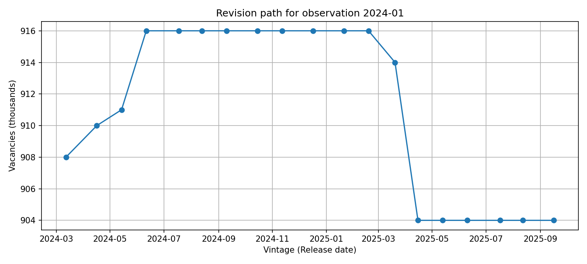

# Bank of England – MPT – Data Scientist Take‑Home (Vacancy AP2Y)

This repository implements an end‑to‑end, **reproducible** mini‑project for the ONS vacancy series (AP2Y), focusing on:
- **Automated ingestion** of CSV vintages from ONS “previous versions”
- **Vintage‑aware structuring** of monthly observations
- **Revision visualisation**
- **Simple forecasting baselines**
- **Best practices** (tests, lint, CI, Make targets)

> **Target series:** https://www.ons.gov.uk/employmentandlabourmarket/peopleinwork/employmentandemployeetypes/timeseries/ap2y/lms/previous

---

## Design choices (high‑level)

- **Vintage = CSV header `Release date`** (parsed from each file’s metadata). When absent, log a warning.
- **Monthly only**: `Period` is parsed with robust regex for `YYYY MON` formats. Quarterly/Yearly rows are dropped.
- **Schema (long)**:
  - `vintage_date` (YYYY‑MM‑DD), `observation_month` (YYYY‑MM‑01), `value` (int)
  - extra: `series_id`, `dataset_id`, `pre_unit`, `unit`
- **Reproducibility**: zero hard‑coded absolute paths; `Makefile` targets; deterministic outputs; tests use **mock HTML & CSV** (no network needed).

---

## Commands

- `python -m src.boe_vac.ingest --num-files 20`
  Scrape latest & previous pages, collect CSV links, download into `data/raw/` and write a manifest.

- `python -m src.boe_vac.transform`
  Parse raw CSVs → extract metadata (incl. `vintage_date`) and monthly data → write `data/processed/vacancies_long.csv`.

- `python -m src.boe_vac.viz --month 2024-01`
  Plot revision path for the given observation month.

---

## Patterns & Revisions Over Time

Below is an example revision path focusing on **January 2024**.
*(Regenerate by running: `python -m src.boe_vac.viz --month 2024-01`)*

**Observation**
UK vacancy statistics are generally published each month between the **10th and the 20th**. At each release, the observation for **T‑2** (two months prior) is newly published and earlier observations are **revised**.

For example, the vacancy estimate for **January 2024** was first published on **12 March 2024** at **908** *(thousands)*. Over the next **three releases** it was revised up to **916** by **11 June 2024**. That value then held for a while, before being revised down more substantially on **20 March 2025** and **15 April 2025**, leaving the latest value at **904** — **lower than the initial estimate**.

---
